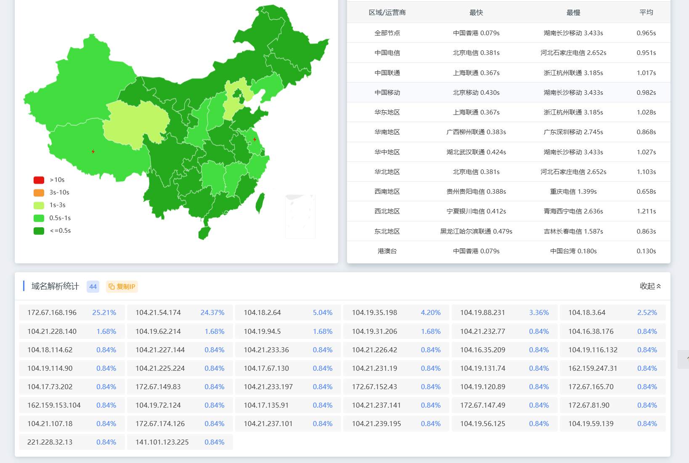

# 关于
重新构建了一套，集互联网优选服务器之大成者，适用于优化网站的访问。

为什么从 **dnspod（腾讯）** 转到 **阿里云 DNS**？  
主要还是考虑每条线路限制数的问题。

| 服务商    | 免费套餐 | 最低阶付费 | 收费金额                   |
|-----------|----------|------------|----------------------------|
| **dnspod** | 2条      | 10条       | 99元/年起                  |
| **alidns** | 10条     | 100条      | 58元/年起（优惠后可28元）  |


### 特点：
#### 基于多源数据的 IP 优选

- 通过访问多个在线资源，实时提取和更新最优 IP 地址，确保网络路径的最小延迟和最大吞吐量。
- 针对不同运营商（如移动、联通、电信）的 IP 地址进行精细化分类，优化用户的访问路径。

#### 基于阿里云 API 的自动化 DNS 管理

- 利用阿里云的 API 接口，实现 DNS 记录的全生命周期管理，包括查询、添加、更新和删除。
- 内置去重和冲突检测机制，确保 DNS 记录的唯一性和准确性。

#### 基于动态调整的资源优化

- 当某条线路的 DNS 记录达到预设上限时，系统自动淘汰最早的记录，确保最新的优选 IP 能够及时生效。
- 通过动态调整机制，持续优化网络性能，提升用户体验。


---

# 一般环境
1.  `pip install aliyun-python-sdk-core aliyun-python-sdk-alidns cloudscraper`
2.  填写alidns-key
3.  每5分钟`python cf2alidns.py`（不得低于2分钟/次）

# docker部署
```
docker run -d \
  --name cfsdns \
  -e ALIYUN_ACCESS_KEY_ID="ALIYUN_ACCESS_KEY_ID" \
  -e ALIYUN_ACCESS_KEY_SECRET="ALIYUN_ACCESS_KEY_SECRET" \
  -e ALIYUN_PACKAGE_NUM=100 \
  -e domain_rr="x" \
  -e domain_root="abc.com" \
  wanxve0000/cfsdns:latest
```
说明
```
ALIYUN_PACKAGE_NUM=线路数(免费10，付费100默认值)
domain_rr=子域名
domain_root=主域/根域
```

### 上效果图（刚刚跑满，还没到最佳）

### 感谢
<https://github.com/ddgth/cf2dns>


<https://github.com/ZhiXuanWang/cf-speed-dns>