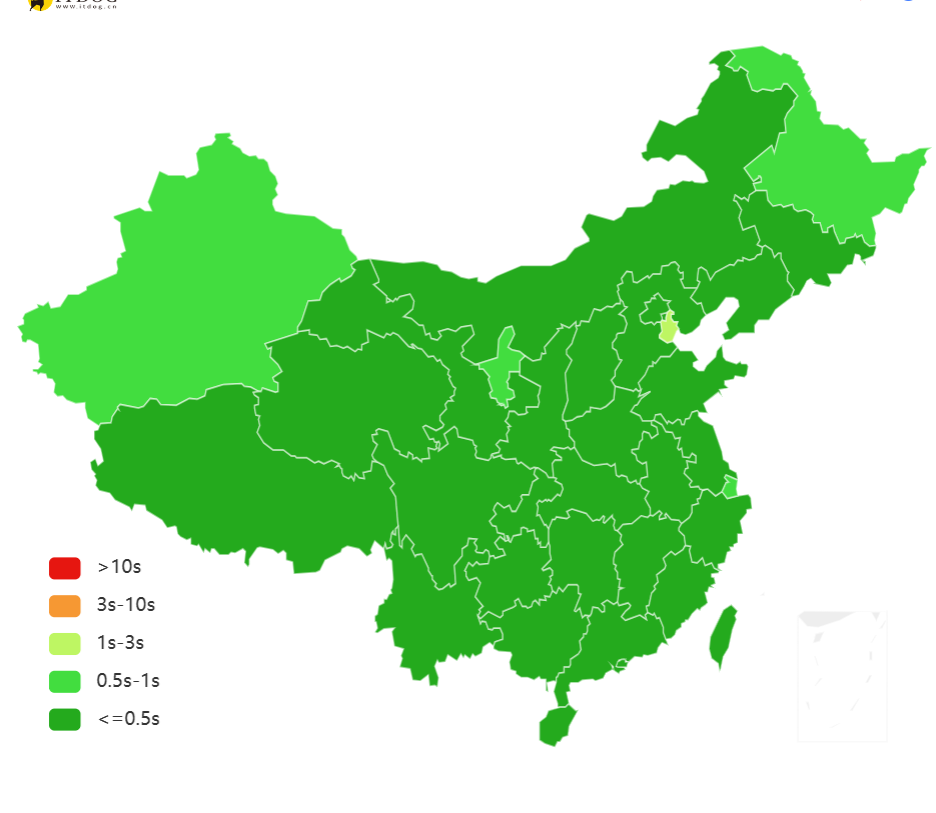
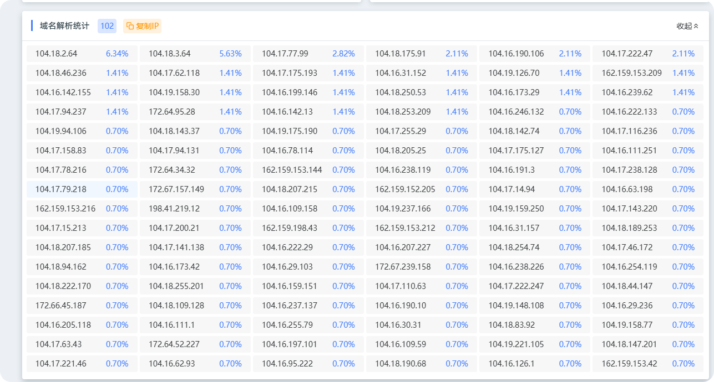

# Test
test分支引入了奇奇怪怪的数据源，加入了缓存域和自动删除记录功能（不一定是更好）。最低要求2.5核2.5G

### docker-compose运行
```
services:
  app:
    image: wanxve0000/cfsdns:test
    environment:
      ALIYUN_ACCESS_KEY_ID: "ALIYUN_ACCESS_KEY_ID"
      ALIYUN_ACCESS_KEY_SECRET: "ALIYUN_ACCESS_KEY_SECRET"
      ALIYUN_PACKAGE_NUM: "100"
      SLEEPTIME: "480"
      domain_rr: "www"
      domain_root: "domain.com"
```

### python运行
```
cat << EOF > .env
# 阿里云 DNS 配置
ALIYUN_ACCESS_KEY_ID="请在这里填入您的Access Key ID"
ALIYUN_ACCESS_KEY_SECRET="请在这里填入您的Access Key Secret"
ALIYUN_PACKAGE_NUM="100" #alidns套餐线路数上限
SLEEPTIME="480" #任务休眠时间

# 生效域名配置
domain_rr="www"
domain_root="domain.com"
EOF

python main.py
```

### docker-cli运行
```
docker run --rm \
  -d \
  --name cfsdns-test \
  -e ALIYUN_ACCESS_KEY_ID="请替换为您的AccessKeyID" \
  -e ALIYUN_ACCESS_KEY_SECRET="请替换为您的AccessKeySecret" \
  -e ALIYUN_PACKAGE_NUM="100" \
  -e domain_rr="www" \
  -e SLEEPTIME="480" \
  -e domain_root="domain.com" \
  wanxve0000/cfsdns:test
```

为什么从 **dnspod（腾讯）** 转到 **阿里云 DNS**？  
主要还是考虑每条线路限制数的问题。

| 服务商    | 免费套餐 | 最低阶付费 | 收费金额                   |
|-----------|----------|------------|----------------------------|
| **dnspod** | 2条      | 10条       | 99元/年起                  |
| **alidns** | 10条     | 100条      | 58元/年起（优惠后可28元）  |


### 特点：
#### 基于多源数据的 IP 优选

- 通过访问多个在线资源，实时提取和更新最优 IP 地址，确保网络路径的最小延迟和最大吞吐量。
- 针对不同运营商（如移动、联通、电信）的 IP 地址进行精细化分类，优化用户的访问路径。

#### 基于阿里云 API 的自动化 DNS 管理

- 利用阿里云的 API 接口，实现 DNS 记录的全生命周期管理，包括查询、添加、更新和删除。
- 内置去重和冲突检测机制，确保 DNS 记录的唯一性和准确性。

#### 基于动态调整的资源优化

- 当某条线路的 DNS 记录达到预设上限时，系统自动淘汰最早的记录，确保最新的优选 IP 能够及时生效。
- 通过动态调整机制，持续优化网络性能，提升用户体验。


---


### test分支运行12小时后效果图


### 感谢
<https://github.com/ddgth/cf2dns>

<https://github.com/ZhiXuanWang/cf-speed-dns>
